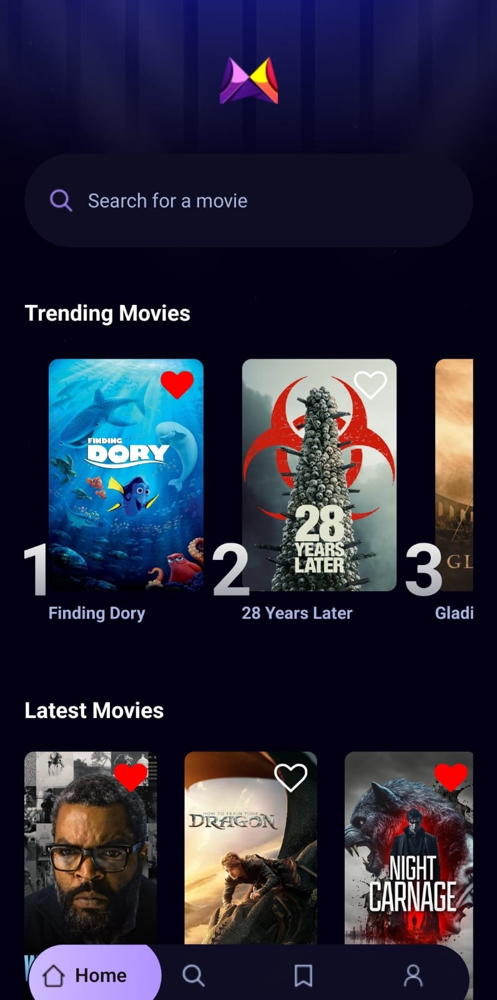
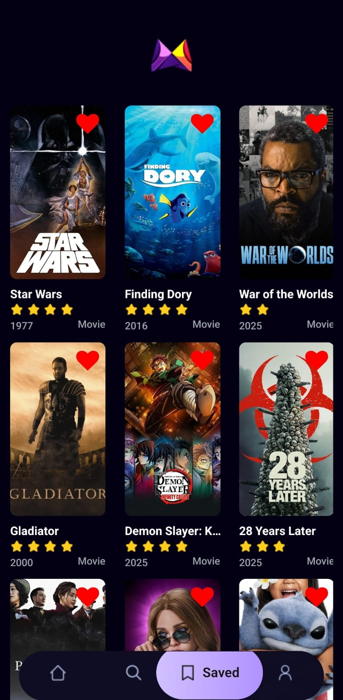

# MovieFlix

MovieFlix is a React Native application that allows users to browse, save, and manage their favorite movies. The app integrates with Clerk for authentication, Appwrite for backend services, and Jotai for state management. It provides a seamless experience for signed-in users to view and manage their saved movies.

---

## Features

- **Authentication**: Sign in and sign up functionality powered by Clerk.
- **Saved Movies**: View and manage a list of saved movies.
- **Responsive UI**: Optimized for mobile devices with React Native components.
- **Global State Management**: Lightweight state management using Jotai.
- **Dynamic Navigation**: Navigate between pages using Expo Router.
- **Backend Services**: Appwrite powers the database and API functionality, while Clerk manages authentication.

---

## 📱 Screenshots

<div align="center">
  
  
</div>

---

## 🎥 Demo

Watch a short video walkthrough of the app in action:

👉 [YouTube Shorts – MovieFlix App Demo](https://www.youtube.com/shorts/_XT4F4Dq1_c)

---

## 🧰 Tech Stack

- **React Native**: Framework for building mobile applications.
- **Expo**: Development platform for React Native apps.
- **Jotai**: Lightweight state management library.
- **Clerk**: Authentication and user management.
- **Appwrite**: Backend services for database and API management.
- **TypeScript**: Strongly typed programming language.

---

## Installation

1. Clone the repository:

   ```bash
   git clone https://github.com/your-username/movieflix.git

   ```

2. Navigate to the project directory:

   ```bash
   cd movieflix
   ```

3. Install dependencies:

   npm install

4. Start the development server:

   npm start

---

```
movieflix/
├── app/ # Contains the main application pages
│ ├── (tabs)/ # Folder for tab-based navigation pages
│ │ ├── saved.tsx # Saved movies page
│ │ └── other-pages.tsx # Other pages (e.g., browse, profile)
│ └── index.tsx # Entry point for the app
├── components/ # Reusable UI components
│ ├── SavedMovieCard.tsx # Component for displaying individual saved movies
│ └── OtherComponent.tsx # Other reusable components (e.g., buttons, modals)
├── constants/ # Application-wide constants
│ ├── icons.ts # Icon constants used throughout the app
│ └── colors.ts # Color palette for consistent styling
├── services/ # Backend and state management logic
│ ├── savedMoviesAtom.ts # Jotai atoms for managing saved movies state
│ ├── api.ts # API service functions for interacting with external APIs
│ └── appwrite.ts # Appwrite integration for backend services
├── assets/ # Static assets like images and fonts
│ ├── icons/ # Folder for app icons
│ └── images/ # Folder for app images
├── .env # Environment variables for API keys and configuration
├── README.md
└── package.json
```

---

## 🔒 Environment Variables

Create a `.env` file in the root directory and include:

```
# TMDB
EXPO_PUBLIC_MOVIE_API_KEY=...

# EXPO
EXPO_PUBLIC_APPWRITE_PROJECT_ID=...
EXPO_PUBLIC_APPWRITE_ENDPOINT=...
EXPO_PUBLIC_APPWRITE_PROJECT_NAME=...
EXPO_PUBLIC_APPWRITE_DATABASE_ID=...
EXPO_PUBLIC_APPWRITE_METRICS_COLLECTION_ID=...
EXPO_PUBLIC_APPWRITE_SAVED_COLLECTION_ID=...

# Clerk
EXPO_PUBLIC_CLERK_PUBLISHABLE_KEY=...

```

---

## 🚀 How to Use

- Launch the app using `npm start` (or `npx expo start`)
- Sign up or log in
- Browse movies, save your favorites, and view them in the Saved tab

---

## 🧑‍💻 Author

Built by [**Jai Bhullar**](https://jaibh-portfolio.vercel.app/) – aspiring front-end/full-stack developer based near London.

- 📫 Email: jaibhullar.developer@outlook.com
- 🔗 **LinkedIn:** [linkedin.com/in/jai-bhullar-dev](https://www.linkedin.com/in/jai-bhullar-dev)
- 📄 [View My CV](https://drive.google.com/drive/folders/11INqiG1lzqst5JbgNXueFMdqKZr6JfP9?usp=sharing)

---

## 📝 License

MIT License. Feel free to use, modify, or contribute!
